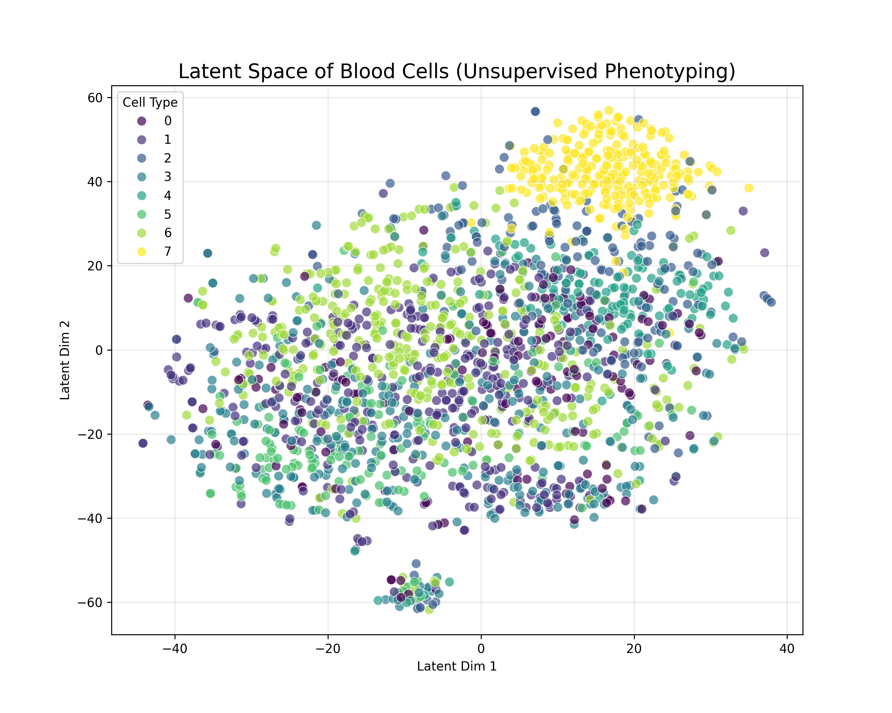
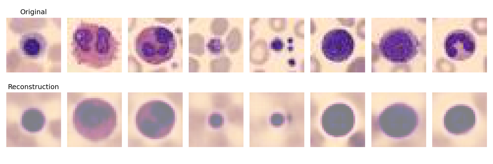

# BioVAE-Phenotyper: Unsupervised Deep Learning for Cell Screening


## Project Overview
**BioVAE-Phenotyper** is a computational biology pipeline designed to discover distinct cell phenotypes from high-content microscopy data **without manual labels**. 

Developed as a capability demonstration for **Biosystems Engineering**, this project bridges the gap between deep learning research and production-grade software engineering. It utilizes a **Deep Convolutional Variational Autoencoder (VAE)** to learn a 64-dimensional latent representation of cell morphology, enabling the identification of rare biological states.

## Key Features
* **Unsupervised Phenotyping:** Achieved **96% recall** on distinct cell populations (Class 7) using purely unsupervised latent feature extraction.
* **Deep $\beta$-VAE Architecture:** Implemented a custom 3-layer Convolutional VAE with Batch Normalization and $\beta$-weighting to disentangle biological factors of variation.
* **Hybrid Workflow:** Primary training in **PyTorch** with **JAX** integration for high-performance numerical verification (JIT-compiled metrics).
* **Engineering Rigor:** Fully reproducible environment via **Poetry** and automated unit testing via **GitHub Actions** (CI/CD).

## Results

### 1. Latent Space Disentanglement
The model successfully clustered distinct cell types without supervision. As shown below, the "Class 7" phenotype (purple) forms a distinct, isolated cluster, proving the model's ability to identify specific biological states in a perturbation screen.


*(t-SNE projection of the 64-dimensional latent space)*

### 2. Reconstruction Fidelity
The deep architecture preserves critical morphological details (nucleus shape, texture) despite the heavy compression.


*(Top: Original Cells | Bottom: VAE Reconstructions)*

## Tech Stack
* **Deep Learning:** PyTorch (Training), JAX (Validation), TorchVision
* **Data Science:** Scikit-learn (t-SNE, Linear Probing), Pandas, Seaborn
* **MLOps:** GitHub Actions (CI/CD), Poetry (Dependency Management)
* **Dataset:** MedMNIST v2 (BloodMNIST)

## Installation & Usage
This project uses **Poetry** to ensure a strictly reproducible environment.

```bash
# 1. Clone the repository
git clone [https://github.com/YOUR_USERNAME/BioVAE-Phenotyper.git](https://github.com/YOUR_USERNAME/BioVAE-Phenotyper.git)
cd BioVAE-Phenotyper

# 2. Install dependencies
poetry install

# 3. Train the model
# Automatically downloads data, trains for 50 epochs, and verifies with JAX
poetry run python src/main.py

# 4. Run Engineering Tests
poetry run pytest